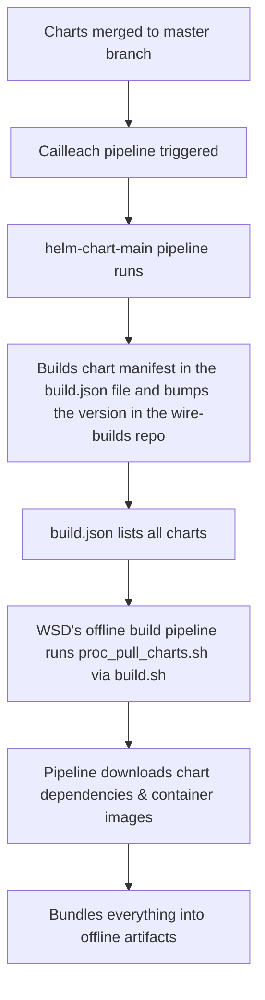

# Helm Charts Repository

This repository contains a collection of Helm charts designed to simplify the deployment and management of Wire applications in the Kubernetes environment. Each chart is customizable and follows best practices to ensure reliability and scalability.

## Features

- Pre-configured templates for common resources.
- Easy customization using `values.yaml`.
- Support for a wide range of use cases and applications.
- Regular updates and maintenance.

## Usage

These charts are wrappers around the original upstream charts. The original charts are managed as dependencies in the `requirements.yaml` file with the appropriate upstream values, for example:

```yaml
dependencies:
  - name: <chart-name>
    version: <chart-version>
    repository: <chart-repository>
```

## Charts Managed by the Pipeline

- k8ssandra-operator
- keycloakx
- postgresql
- openbs
- smallstep-accomp
- step-certificates
- cert-manager

Once the charts are merged to the master branch, the [cailleach pipeline](https://github.com/zinfra/cailleach), builds the chart manifest in a JSON file ([build.json](https://github.com/wireapp/wire-builds/blob/dev/build.json)) in the wire-builds repository via [helm-chart-main](https://github.com/zinfra/cailleach/blob/master/ci/pipelines/prod-ops/helm-charts-main.dhall) pipeline. All the charts in the `build.json` are pulled by the WSD's offline build pipeline via [proc_pull_charts](https://github.com/wireapp/wire-server-deploy/blob/master/offline/tasks/proc_pull_charts.sh),then the pipeline downloads dependencies, container images, and bundles them in the offline artifacts as part of the build process.

Flow chart of the build process:


